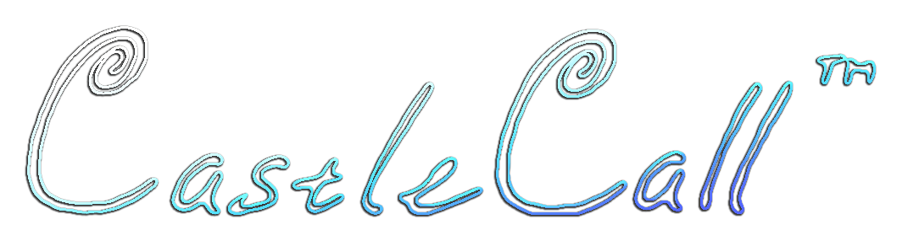

# CastleCall

> PPGSO Projekt 2021
> Ondrej Špánik & Marek Klanica

## Used libraries
TODO

## Build instructions
TODO

## Map: Blender to OBJ

Linking script `blender/map.py` generates a `map.txt` file, which contains all transformations, clones, uv paths and internal objects. Every single object in `map.txt` had its transformations normalized. See mentioned script for details. 

**Modifications to the map are recommended to be done as follows:**

1. Open `blender/map.blend` in Blender 2.93 or newer and make said modifications
   - Pay attention during OBJ export, so that the settings in the save dialog match `blender/export_settings.png`
   - Blender project currently doesn't include any animations as these are likely to be done manually such as in case of `water_bezieranim` which shall be animated using the Bezier Surface method.
2. Modify the `blender/map.py` script in case the modifications are related to transformations and special data unsupported by OBJ
   - UVs in `blender` directory are for Blender work only, more below...
3. **Run the `blender/map.py` script from within Blender** so that the context exists (details inside script). This will generate a  `map.txt` file.
4. Grab the `map.txt` file, export any new UV textures and/or .OBJ models, and **move these into the `data` folder to be used by OpenGL**

TODO: OBJ and `map.txt` C++ importer for OpenGL